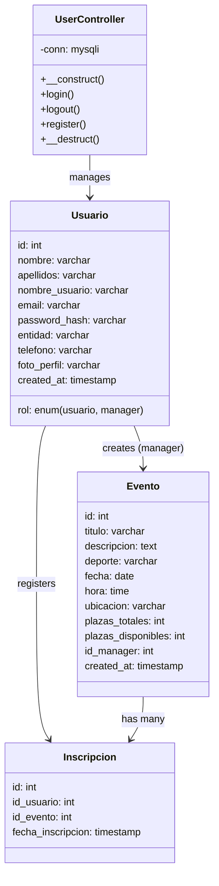
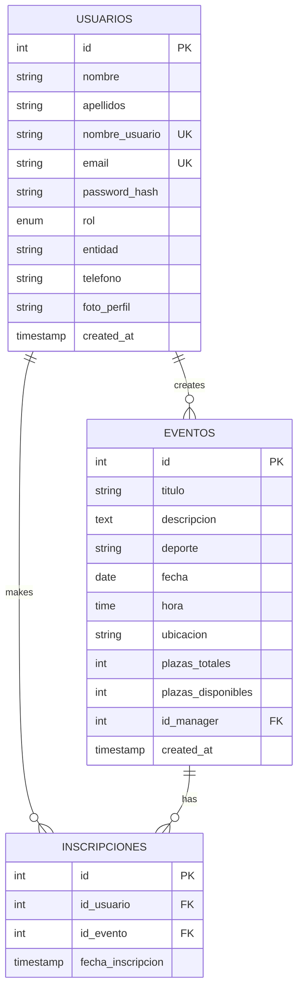
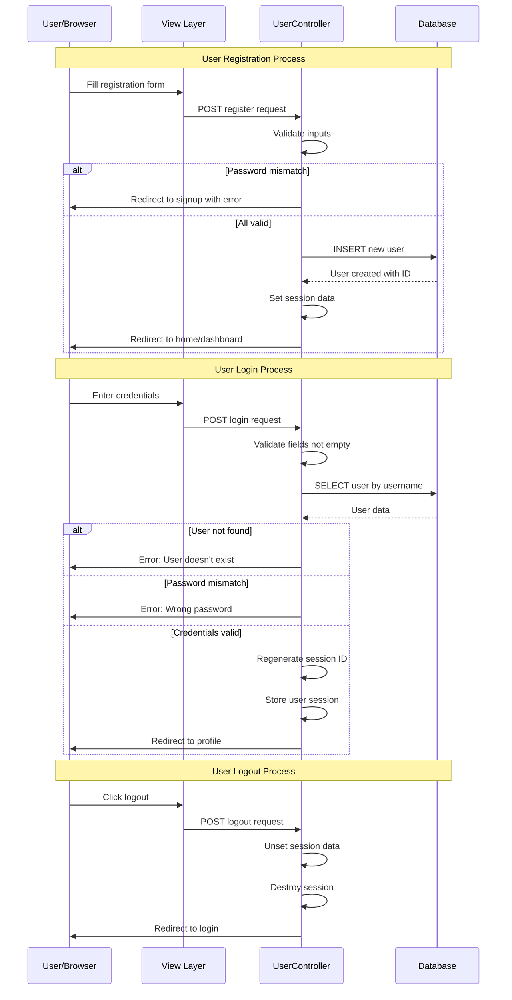
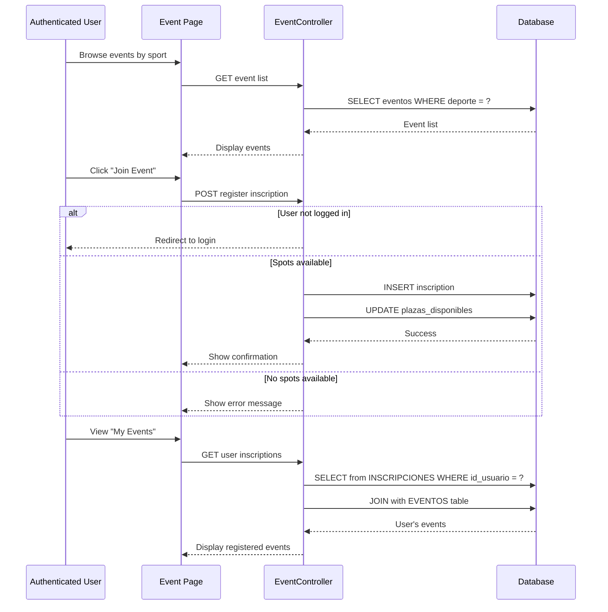

# EventSportsBCN - Sports Events Management System

A PHP-based web application for managing and organizing sports events in Barcelona. Users can browse events by sport type, register for events, and managers can create and manage events.

## 📋 Table of Contents

- [Project Overview](#project-overview)
- [Architecture](#architecture)
- [Database Structure](#database-structure)
- [User Roles](#user-roles)
- [Features](#features)

---

## 🎯 Project Overview

EventSportsBCN is a sports event management platform that allows:
- **Regular Users**: Browse sports events, register for events, manage their profile, and track signed/saved events
- **Managers**: Create and manage sports events, track registrations, and manage their organization profile

---

## 🏗️ Architecture

### Class Diagram



---

## 💾 Database Structure

### Entity Relationship Diagram



---

## 🔄 User Workflows

### Authentication & Registration Flow



### Event Registration Flow



---

## 👥 User Roles

### Regular User
- ✅ Browse sports events (Basketball, Football, Golf, Tennis, Paddle)
- ✅ Register/Sign up for events
- ✅ View profile and followed sports
- ✅ Manage saved events
- ✅ View signed events
- ✅ Update profile information

### Manager
- ✅ All features of regular users
- ✅ Create new events
- ✅ Edit events
- ✅ View event registrations
- ✅ Manage organization profile
- ✅ Upload profile image

---

## 🎮 Features

### Supported Sports
- 🏀 Basketball
- ⚽ Football
- ⛳ Golf
- 🎾 Tennis
- 🏸 Paddle

### Core Functionality

#### User Management
- User registration (regular users and managers)
- User authentication with session management
- Password validation
- Role-based access control

#### Event Management
- Create events (managers only)
- Edit events (managers only)
- Browse events by sport category
- View event details
- Event capacity management

#### Event Registration
- Register for events
- View registered events
- View saved events
- Track event capacity

#### Profile Management
- View/Edit user profile
- Upload profile image (managers)
- Manage organization information (managers)

---

## 📁 Project Structure

```
EventSportsBCN/
├── Controller/
│   └── userControler.php       # User authentication and registration
├── Model/
│   └── Model.sql               # Database schema
├── View/
│   ├── Assets/
│   │   └── ProfileImages/      # User profile images
│   ├── CSS/
│   │   ├── Global/
│   │   │   └── global.css
│   │   └── Styles/             # Page-specific styles
│   └── HTML/
│       └── Pages/              # All application pages
└── README.md
```

---

## 🔧 Technical Stack

- **Backend**: PHP 7.x+
- **Database**: MySQL
- **Frontend**: HTML5, CSS3, JavaScript
- **Paradigm**: MVC (Model-View-Controller)

---

## 🚀 Getting Started

### Prerequisites
- XAMPP or similar PHP/MySQL environment
- PHP 7.0+
- MySQL 5.7+

### Installation

1. Clone/Download the project to your XAMPP htdocs folder:
   ```
   c:\xampp\htdocs\HTML\
   ```

2. Import the database schema:
   ```bash
   mysql -u root < Model/Model.sql
   ```

3. Start XAMPP services (Apache & MySQL)

4. Access the application:
   ```
   http://localhost/HTML/View/HTML/Pages/Login.php
   ```

---

## 📝 Database Configuration

Default configuration in `userControler.php`:
- **Host**: localhost
- **User**: root
- **Password**: (empty)
- **Database**: eventsportsbcn
- **Charset**: utf8mb4

Modify these values in the `UserController::__construct()` method if your setup differs.

---

## 🔐 Security Notes

- Passwords are stored as plain text in the current implementation. **Use PHP's `password_hash()` and `password_verify()` functions in production**
- Implement prepared statements for all database queries
- Add input validation on the server side
- Use HTTPS in production
- Implement CSRF protection tokens
- Add rate limiting for login attempts

---

## 📞 Support

For issues or questions, please refer to the code documentation within each PHP file.

---
**Created**: 2026  
**Last Updated**: April 2026
